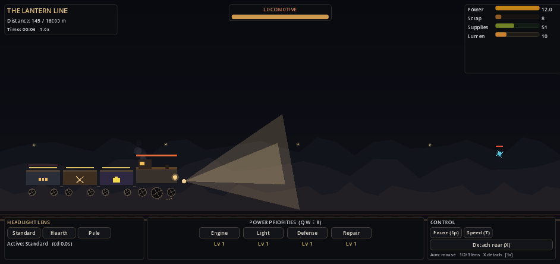
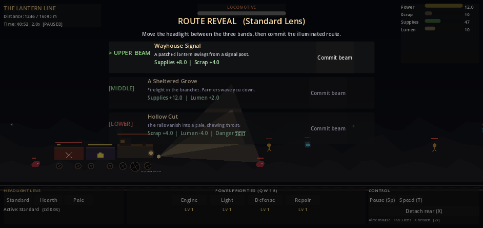

# The Lantern Line

A fortress-train survival prototype through a world without sunlight. Godot 4.7.2, GDScript, Compatibility renderer. Code-drawn vector visuals, original loading artwork, and procedurally generated audio.

**[Play The Lantern Line](https://skyeatsbrad.github.io/lantern-line/)**



## Fantasy

You command an armored train rolling through deep ink. The locomotive's headlight is the only thing that decides what the world becomes. Change lenses to pull different signatures out of the dark. Choose Upper, Middle, or Lower on every route reveal. Manage power between engine, light, defense, and repair. Add and repair cars at the one station. Detach a damaged rear car when the darkness demands sacrifice. Reach the Dawn Beacon.

## How to play

Run the Godot editor's project (`project.godot`) or the built binary. From the title:

- **New Run** starts a fresh run with a deterministic seed.
- **Continue** resumes from the last autosaved checkpoint (autosaves every ~8 seconds).

### Controls

| Input | Action |
|---|---|
| Mouse | Aim the headlight. Vertical band decides which route position (Upper/Middle/Lower) you choose during reveals. |
| **1 / 2 / 3** | Select Standard / Hearth / Pale lens. 4-second cooldown between switches. |
| **Q W E R** | Cycle Power priority for Engine / Light / Defense / Repair (0-3). |
| **Space** | Pause / resume. |
| **T** | Toggle 1x / 2x game speed. |
| **X** | Detach the rear car. Destroys nearby ground pursuers and grants an eight-second speed boost. Permanent for this run. |
| **↑ / → / ↓** | Choose Upper / Middle / Lower during a Route Reveal. |

You can also click all HUD panels (lens, priority, pause/speed/detach, route cards) for touch-friendly mouse play.

### Loop

- Every ~52 seconds a **Route Reveal** freezes the action and presents three spatial signatures. Aim the headlight into the upper, middle, or lower band, then commit that illuminated route. The active lens biases which categories (living, machinery, danger) are more likely to appear.
- **Enemies** appear steadily: **Pursuers** eat the rear coupling, **Boarders** land on the roof and stalk the loco, **Drainers** attack the light and lumen.
- Around 7,600 m there is a **Station**: buy a new car (10 scrap, max 5 cars), fully repair (12 scrap), or reorder the consist.
- Around 14,500 m **The Longshadow** appears as the region boss.
- At 16,000 m with the boss down, the **Dawn Beacon** ends the run in victory. A typical 1x run lasts roughly 9–13 minutes depending on engine priority and train weight.
- Defeat if locomotive HP hits zero, or supplies stay at zero long enough for the crew to fail.

## Structure

```
project.godot
export_presets.cfg
icon.svg
boot_splash.svg
boot_splash.png
assets/
  screenshots/       # Repository previews; excluded from runtime behavior
data/
  cars.json          # 6 car types with integrity, power, weight, trait
  crew.json          # 4 named crew with one-line traits
  enemies.json       # 3 standard + 1 boss
  lenses.json        # 3 lenses with weight biases
  route_events.json  # ~8 authored route outcomes
scenes/
  main.tscn
  game_world.tscn
scripts/
  autoload/
    game_manager.gd     # persistence, settings, meta (best distance / wins), autosave checkpoints
    audio_manager.gd    # pooled AudioStreamPlayer, procedural WAV click/alarm/impact/reveal/detach/victory/defeat + ambient wheel-thump generator
  main.gd               # title screen, scene switching, smoke/probe entry points
  run/
    game_world.gd       # ONLY cross-system signal wiring; owns RunState for a run
    run_state.gd        # all runtime state: distance, resources, cars, crew, priorities, pause/speed; serializable
    smoke_test.gd       # deterministic offline tests (route gen, tick, enemy, detach, save roundtrip, end states)
    runtime_probe.gd    # 8-second live scene run that verifies distance advance + detach + no runtime errors
  world/
    route_director.gd   # deterministic seeded route reveals with lens-biased weighted picks
    world_renderer.gd   # parallax ridges, rails/ties, sky gradient, headlight cone, distant lanterns
  train/
    train_controller.gd # headlight aim (mouse -> direction; upper/middle/lower band)
    train_renderer.gd   # locomotive + cars cutaway, wheels/spokes rotating, smoke, sparks, boarders on roof, damage flicker
  combat/
    enemy.gd            # pure data enemy for pool
    enemy_director.gd   # pool of 40, spawn cadence scales with distance, light+turret damage, boss, on_detach purge
  ui/
    hud.gd              # railway-equipment HUD: resource gauges, priorities, lens breakers, pause/speed/detach
    route_choice.gd     # modal route reveal with three cards
    station_panel.gd    # one station: add/repair
    end_screen.gd       # victory/defeat
  effects/
    effects_layer.gd    # pooled hit sparks, screen shake, dawn overlay
build/
  web/                  # web build output (see below)
  windows/              # windows build output
docs/                   # verified GitHub Pages build
```

### Architecture notes

- **Two autoloads only.** `GameManager` = persistence/settings (versioned JSON save, autosave every 8 s, meta stats). `AudioManager` = procedural WAV pool + a live `AudioStreamGenerator` for wheel-rhythm ambient. Both are silence-safe: audio only starts after the first user gesture (web-compat) and every call short-circuits if not enabled.
- **`game_world.gd` is the only cross-system wiring point.** All other scripts are single-responsibility. No event bus. No ECS.
- **Runtime state lives in the run scene, not a singleton.** `RunState` is owned by `game_world` and cleaned up when the run ends.
- **Deterministic seeded RNG.** `RouteDirector` derives a per-reveal RNG from `run_seed ^ reveal_index`; same seed + same lens history yields the same three choices.
- **Static typing everywhere.** Godot's typed GDScript is used across every field, param, and return.
- **Save schema is versioned.** `SAVE_VERSION=1`. Loads validate the version and fall back cleanly.
- **Enemy pool** is fixed size 40; no runtime allocation churn under sustained spawning.

## Validation

All validation was run against Godot 4.7.2 with the export templates installed at
`%APPDATA%\Godot\export_templates\4.7.2.stable`.

### Import / parse

```
"C:\Users\bradleywo\Tools\Godot-4.7.2\Godot_v4.7.2-stable_win64_console.exe" --headless --path . --import
```

Reported no parse or import errors after all fixes.

### Deterministic smoke test (offline data + state tests)

```
$env:LANTERN_SMOKE = "1"
"C:\Users\bradleywo\Tools\Godot-4.7.2\Godot_v4.7.2-stable_win64_console.exe" --headless --path .
```

Result: `[smoke] ALL PASSED`, exit code 0. Verifies:

- All JSON data files load
- Route generation is deterministic for the same seed+index and produces three positions
- `RunState.tick` advances distance, drains supplies, enforces power balance
- Destroyed cars no longer contribute power production or draw
- Lens switch respects cooldown
- Enemy spawn + death via HP=0
- `detach_rear_car` removes exactly one car
- Detachment grants its eight-second speed boost
- `to_dict` → `JSON.stringify` → `JSON.parse_string` → `apply_dict` roundtrip preserves distance
- A resumed boss encounter restores The Longshadow
- A complete deterministic campaign commits 13 routes, adds and reorders a Defense car at the station, defeats the boss, and reaches the Dawn Beacon in 725 seconds
- Completing a run cannot recreate a stale Continue checkpoint
- Defeat triggers when locomotive HP <= 0

### Live runtime probe (real scene tree, 8s live run)

```
$env:LANTERN_PROBE = "1"
"C:\Users\bradleywo\Tools\Godot-4.7.2\Godot_v4.7.2-stable_win64_console.exe" --headless --path .
```

Result: `[probe] OK distance=<positive value>`, exit code 0. Verifies:

- Game world bootstraps cleanly
- Priority cycle + lens switch fire without errors
- An enemy wave spawns
- Distance advances during the live run
- Exactly one detach removes one car
- The pre-probe save and records are restored afterward
- No SCRIPT ERROR output

### Exported binary self-check

The exported Windows binary reports `[smoke] ALL PASSED` and exits 0 when run
headlessly with `LANTERN_SMOKE=1`.

## Exports

Two presets are configured in `export_presets.cfg`:

- **Web** (Compatibility renderer, no-threads template): outputs to `build/web/index.html`
- **Windows Desktop** (x86_64): outputs `build/windows/TheLanternLine.exe` with its adjacent `TheLanternLine.pck`

Commands:

```
"C:\Users\bradleywo\Tools\Godot-4.7.2\Godot_v4.7.2-stable_win64_console.exe" --headless --path . --export-release "Web"
"C:\Users\bradleywo\Tools\Godot-4.7.2\Godot_v4.7.2-stable_win64_console.exe" --headless --path . --export-release "Windows Desktop"
```

Web output (exact paths):

```
build\web\index.html
build\web\index.js
build\web\index.wasm
build\web\index.pck
build\web\index.png
build\web\index.audio.worklet.js
build\web\index.audio.position.worklet.js
build\web\.nojekyll        # ensures GitHub Pages does not filter the underscore-prefixed dirs
```

The verified files are mirrored into `docs/`, including `.nojekyll`, for publication from the `main` branch's `/docs` folder.

## Accessibility & options (title screen)

- Master volume slider (persisted in `user://lantern_line.save`)
- Screen shake toggle
- Reduced motion toggle (kills smoke, sparks, camera shake, and ridge sway)
- Text scale is honored via `GameManager.get_setting("text_scale", 1.0)` in the HUD builder

## Known limitations

- Procedural audio uses `AudioStreamGenerator` for the wheel-rhythm ambient. In some browsers the ambient may sound quieter than the intended thump; UI clicks / alarms / stingers use pre-baked in-memory WAVs and are consistent.
- The exported Windows exe is ~109 MB; that is the standard Godot 4.7.2 template size. The separate Windows/web `.pck` game payload is ~170 KB.
- Cosmetic warnings at exit (`ObjectDB instances leaked`, `RID of type CanvasItem`) come from the Godot engine's teardown of UI + AudioStreamPlayer nodes and do not affect gameplay or the exit code.
- The game targets 1280x720 by default, stretches down to 960x540 landscape via `canvas_items` stretch. Phone portrait is not targeted per the brief.
- Only one region, one boss, and one ending exist per the brief's content caps.

## Route reveal

The active lens changes which signatures the darkness is likely to produce. The headlight's vertical aim selects the upper, middle, or lower possibility while the world is paused.



## GitHub Pages

The verified web export is mirrored into `docs/` and published from the `main` branch's `/docs` folder. Re-export to `build/web/`, then refresh `docs/` before publishing an update.

## Save file

All persistence lives at `user://lantern_line.save`, which on Windows resolves to
`%APPDATA%\Godot\app_userdata\The Lantern Line\lantern_line.save`. It is a JSON file
containing settings, meta stats, and (if present) the pending run checkpoint.
Save export/import can be done by copying that file directly.

## Credits

Original concept, design, and implementation: **The Lantern Line** prototype.
